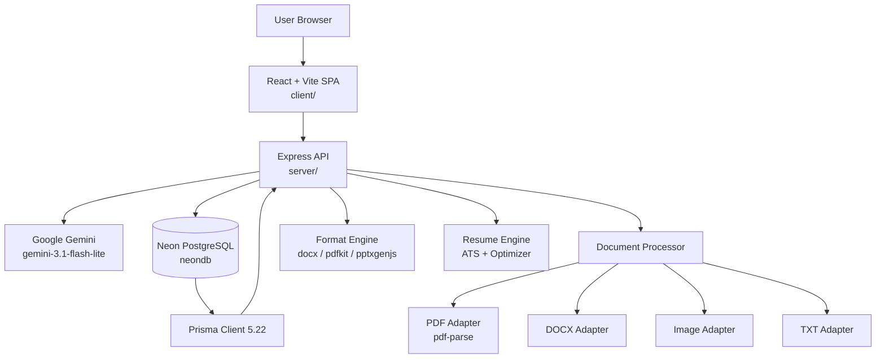

# Architecture — ContentSpine AI

## System Overview

ContentSpine AI is a full-stack serverless web application deployed on Vercel. The frontend is a React SPA; the backend is an Express API compiled to TypeScript; both are served from the same Vercel project via `vercel.json` routing rules.



---

## Frontend (`client/`)

| Technology | Version | Purpose |
|---|---|---|
| React | 18 | UI framework |
| TypeScript | 5.x | Type safety |
| Vite | 8.x | Build tool + dev server |
| Custom CSS | — | Styling (no Tailwind) |

### Pages & Routes

The application uses a custom client-side router (`useState`-based, no react-router):

| Route ID | Component | Description |
|---|---|---|
| `dashboard` | `DashboardPage` | Real Neon metrics overview |
| `projects` | Inline in App | Project list (stub) |
| `new-transformation` | `UploadStage` | Source document upload |
| `processing` | `ProcessingScreen` | Ingestion progress |
| `spine` | `ContentSpineViewer` | Fact browser + lock controls |
| `config` | `ConfigScreen` | Output type selector |
| `generating` | `GenerationProgressScreen` | Generation progress |
| `workspace` | `ReviewWorkspace3Pane` | 3-pane review: source ↔ spine ↔ outputs |
| `resume-studio` | `ResumeStudio` | 8-tab resume intelligence |
| `agents` | `AgentsPage` | Knowledge agent chat |
| `history` | `HistoryPage` | Conversation history |
| `analytics` | `AnalyticsPage` | Activity analytics |
| `settings` | `SettingsPage` | Provider + model config |

### Sidebar Navigation (actual items)

1. Dashboard
2. Projects
3. Content Spine
4. Review Workspace
5. Resume Studio *(ATS badge)*
6. AI Agents *(Knowledge badge)*
7. History
8. Analytics
9. Settings

---

## Backend (`server/`)

| Technology | Version | Purpose |
|---|---|---|
| Node.js | 18+ | Runtime |
| Express | 4.x | HTTP framework |
| TypeScript | 5.x | Type safety |
| Prisma | 5.22 | ORM |
| multer | 1.4.5 | File upload handling |
| dotenv | 16.x | Environment configuration |

### Server Structure

```
server/src/
├── index.ts              # App entry point, route mounting, health endpoints
├── config/
│   ├── index.ts          # Config object, Prisma singleton, DB flags
│   └── dbInit.ts         # Schema initialization for cold-starts
├── middleware/
│   ├── errorHandler.ts   # Global error handler, Prisma error sanitizer
│   └── security.ts       # Rate limiter, security headers, upload filter
├── controllers/
│   ├── projectController.ts    # Content Spine + generation workflows
│   ├── resumeController.ts     # Resume + ATS + export
│   ├── agentController.ts      # Knowledge agent
│   ├── historyController.ts    # Conversation history
│   └── aiProviderController.ts # Provider health + generation
├── services/
│   ├── projectService.ts       # Business logic for projects
│   ├── agentService.ts         # Agent orchestration
│   ├── historyService.ts       # Conversation + message persistence
│   └── providerHealthService.ts # Gemini health/rate-limit tracking
├── repositories/
│   └── projectRepository.ts   # Prisma queries, dashboard stats
├── processors/
│   ├── documentProcessor.ts   # Chunk/normalize extracted text
│   └── adapters/
│       ├── pdfAdapter.ts      # pdf-parse extraction
│       ├── docxAdapter.ts     # DOCX extraction
│       ├── imageAdapter.ts    # Image text extraction
│       ├── txtAdapter.ts      # Plain text fallback
│       └── types.ts
├── ai/
│   ├── providers/
│   │   ├── factory.ts         # Provider registry + selection
│   │   ├── geminiProvider.ts  # Gemini implementation (primary)
│   │   ├── openAIProvider.ts  # OpenAI implementation (requires OPENAI_API_KEY)
│   │   ├── llamaProvider.ts   # Ollama/Llama3 (local, fallback to mock)
│   │   ├── mockProvider.ts    # Deterministic mock (testing only)
│   │   └── types.ts
│   └── generators/
│       ├── executiveSummaryGenerator.ts
│       ├── linkedinPostGenerator.ts
│       ├── xThreadGenerator.ts
│       ├── advisoryGenerator.ts
│       ├── presentationGenerator.ts
│       ├── infographicGenerator.ts
│       ├── videoPackageGenerator.ts
│       └── baseGenerator.ts
├── engine/
│   ├── formatEngine/
│   │   ├── formatValidator.ts
│   │   ├── styleEngine.ts
│   │   ├── index.ts
│   │   ├── exporters/          # docxExporter, pdfExporter, pptxExporter, dataExporters
│   │   ├── formatters/
│   │   └── converters/
│   └── resumeEngine/
│       ├── atsEngine.ts        # ATS scoring
│       ├── candidateSpine.ts   # Candidate Content Spine builder
│       ├── jobSpine.ts         # Job Description parser
│       ├── resumeExporters.ts  # DOCX + PDF export
│       ├── resumeFactLock.ts   # Fact-lock validation for resumes
│       └── resumeOptimizer.ts  # Gemini-powered optimizer
├── routes/
│   ├── projectRoutes.ts
│   ├── resumeRoutes.ts
│   ├── agentRoutes.ts
│   ├── historyRoutes.ts
│   └── aiProviderRoutes.ts
├── utils/
│   └── response.ts            # Standardized JSON response helpers
└── tests/
    ├── db_production_test_suite.ts
    ├── gemini_rate_limit_test_suite.ts
    ├── neon_history_test_suite.ts
    ├── pdf_extraction_test_suite.ts
    ├── provider_test_suite.ts
    ├── resume_test_suite.ts
    └── agent_harness_test_suite.ts
```

---

## Database

- **Provider**: Neon PostgreSQL (production)
- **ORM**: Prisma 5.22
- **Schema**: `server/prisma/schema.prisma`
- **Connection**: Via `DATABASE_URL` environment variable (server-side only)
- **Singleton pattern**: Prisma client is reused across serverless invocations via `global.prisma`

See [DATABASE.md](DATABASE.md) for the full schema reference.

---

## AI Providers

| Provider | Status | Config |
|---|---|---|
| **Gemini** (`gemini-3.1-flash-lite`) | ✅ Production default | `AI_PROVIDER=gemini`, `AI_API_KEY=<key>` |
| **OpenAI** (`gpt-4o`) | ⚠️ Implemented, not configured in production | Requires `OPENAI_API_KEY` |
| **Llama 3** (Ollama) | ⚠️ Implemented, not available on Vercel | Requires local `OLLAMA_ENDPOINT` |
| **Mock** | ✅ Available (testing only) | `AI_PROVIDER=mock` |

All AI calls are **server-side**. API keys are never exposed to the browser.

---

## Content Spine Architecture

```
Source Document
    ↓
DocumentProcessor
    ↓  (adapter selection by MIME type)
NormalizedChunks (paragraphs with page numbers)
    ↓
GeminiProvider.extractContentSpine()
    ↓
ContentSpineData {
    summary: string
    facts: Fact[]
    entities: Entity[]
    sourceReferences: SourceReference[]
    factLocks: FactLock[]
}
    ↓
Fact Lock UI (human review + lock/unlock)
    ↓
generateOutput() — only locked facts pass to AI
```

**Key invariant:** Generated content is never automatically promoted to a source fact.

---

## Resume Intelligence Architecture

```
Resume Input (DOCX / PDF / form data)
    ↓
candidateSpine.ts → Candidate Content Spine
    ↓
Job Description Input
    ↓
jobSpine.ts → Job Content Spine
    ↓
atsEngine.ts → ATS Scan (9 scoring dimensions)
    ↓
resumeOptimizer.ts → Gemini optimization
    ↓
resumeFactLock.ts → Fact validation (no hallucination)
    ↓
resumeExporters.ts → DOCX / PDF binary export
    ↓
Neon PostgreSQL (Resume, ResumeVersion, ATSScan, CoverLetter, LinkedInProfile)
```

---

## Security Architecture

| Control | Implementation |
|---|---|
| Rate limiting | 120 req/min/IP (in-memory, swap to Redis for scale) |
| Security headers | `X-Content-Type-Options`, `X-Frame-Options`, `X-XSS-Protection`, `Referrer-Policy` |
| Upload filtering | MIME type + extension allowlist, filename sanitization |
| Prisma error sanitization | `DATABASE_UNAVAILABLE` JSON, never exposes host/port |
| File size limits | 50 MB (projects), 20 MB (resume) |
| AI keys | Server-side only, never in `NEXT_PUBLIC_*` or client bundle |

---

## Deployment Architecture

```
GitHub (main branch)
    ↓
Vercel CI/CD
    ↓
vercel-build script:
  1. npm install (client)
  2. prisma generate
  3. prisma db push (if DATABASE_URL set)
  4. tsc (server)
  5. vite build (client)
    ↓
Vercel Serverless Functions
    ↓ (DATABASE_URL env var)
Neon PostgreSQL
    ↓ (AI_API_KEY env var)
Google Gemini API
```
