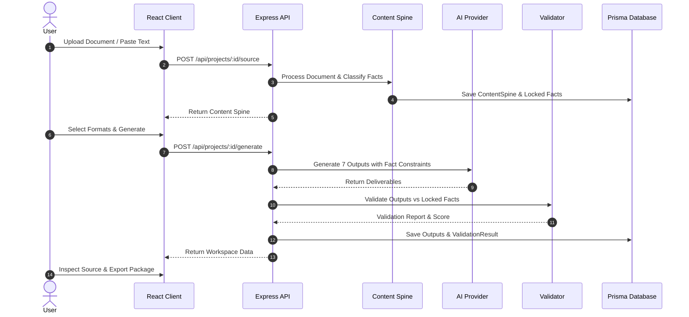

# System & Technical Architecture — ContentSpine AI

## 1. High-Level System Architecture

ContentSpine AI uses a decoupled client-server architecture built around the **Content Spine Architecture** pattern:

```mermaid
graph TB
    subgraph Client Layer [Frontend - React / Vite]
        UI[User Interface & Router]
        Workspace[3-Pane Review Workspace]
        Inspector[4-Tier Lineage Inspector]
        Export[Export Package Engine]
        ApiClient[API Client Layer]
    end

    subgraph Server Layer [Backend - Express / Node.js]
        Routes[REST API Routes]
        Controllers[Project & Output Controllers]
        Services[Project & AI Services]
        DocProc[Document Processor & Multer]
        FactEngine[Fact Lock Engine]
        Validator[Consistency Validator]
        AIAbstr[AI Provider Abstraction]
    end

    subgraph AI Layer [AI Execution]
        MockAI[Mock AI Provider (Demo)]
        GeminiAI[Google Gemini API]
        OpenAI[OpenAI API]
    end

    subgraph Persistence Layer [Database]
        Prisma[Prisma ORM]
        DB[(SQLite / PostgreSQL)]
    end

    UI --> ApiClient
    Workspace --> ApiClient
    Inspector --> ApiClient
    Export --> ApiClient

    ApiClient -->|HTTP REST| Routes
    Routes --> Controllers
    Controllers --> Services
    Services --> DocProc
    Services --> FactEngine
    Services --> Validator
    Services --> AIAbstr

    AIAbstr --> MockAI
    AIAbstr --> GeminiAI
    AIAbstr --> OpenAI

    Services --> Prisma
    Prisma --> DB
```

---

## 2. Component Architecture

### 2.1 Ingestion & Processing Component (`server/src/processors/documentProcessor.ts`)
* Accepts file buffers or raw text.
* Normalizes content into chunks with page numbers and start/end character offsets.
* Supports PDF, TXT, MD, JSON, Images, DOCX, and free-form prompts.

### 2.2 Content Spine & Fact Lock Layer (`server/src/validators/factLockEngine.ts`)
* Extracts structured entities (Person, Organization, Location, Technology, Event).
* Classifies facts into 8 categories (Date, Number, Person, Organization, Location, Claim, Risk, Recommendation).
* Auto-locks critical facts (`isLocked: true`) with source snippets and page numbers.

### 2.3 AI Provider Abstraction (`server/src/ai/provider.ts`)
* Pluggable provider architecture:
  ```ts
  export interface AIProvider {
    name: string;
    extractContentSpine(rawText: string, category: InputCategory): Promise<ContentSpineExtract>;
    generateOutput(spine: ContentSpineData, type: OutputType, audience: AudienceProfile): Promise<GeneratedOutputResult>;
  }
  ```

### 2.4 Consistency Validator (`server/src/validators/consistencyValidator.ts`)
* Compares generated deliverable content against locked facts.
* Computes proportional consistency score:
  $$\text{Score} = \max\left(0, 100 - \frac{\text{Errors}}{\text{Total Facts}} \times 60 - \frac{\text{Warnings}}{\text{Total Facts}} \times 20\right)$$
* Generates detailed `ValidationIssue` items with expected vs found values and suggested fixes.

### 2.5 Auto-Fix Loop (`server/src/services/projectService.ts`)
* Retries output generation up to 3 times for failing outputs only.
* Appends `[Fact Lock — Attempt X/3]` lock annotations to enforce fact compliance.

---

## 3. Data Flow Diagram


