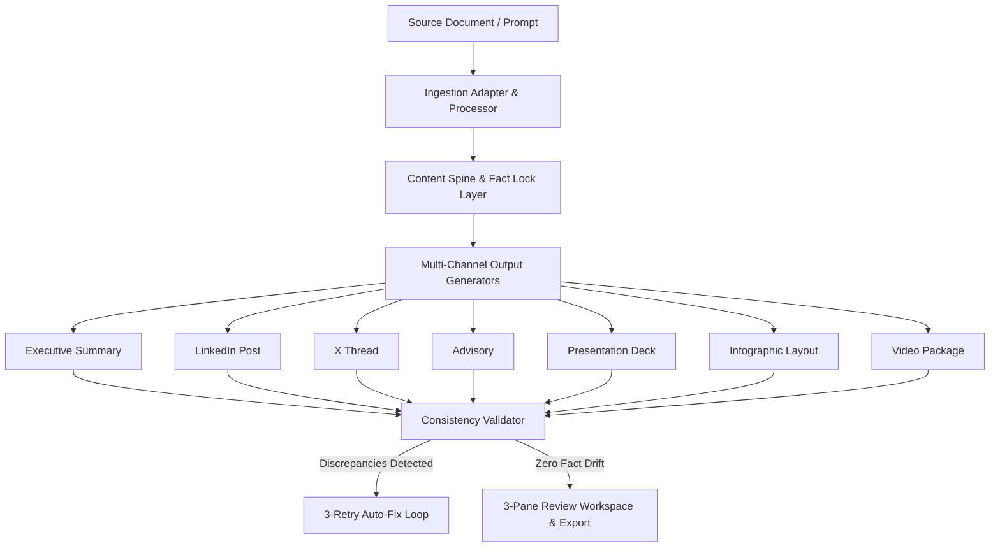

# ContentSpine AI — AI-Powered Content Transformation Platform (SIH 2026)

> **Upload Once → Extract → Build Content Spine → Lock Facts → Generate Multiple Outputs → Validate Consistency → Show Source Mapping → Review → Export**

ContentSpine AI is a government and enterprise-grade content transformation engine designed for Smart India Hackathon (SIH) 2026. The platform's core innovation is the **Content Spine**—a single, immutable source of truth that extracts and locks critical facts (dates, metrics, organizations, dates, claims, and risks) before generating multi-channel communication deliverables.

---

## 🚀 Key Features

* **Multi-Format Source Ingestion**: Supports PDF, TXT, MD, JSON, Images, DOCX, and free-form prompts.
* **Content Spine Architecture**: Single source of truth containing entities, facts, events, risks, recommendations, and source references.
* **Fact Lock Layer**: Automatically classifies and locks critical facts to prevent LLM hallucinations.
* **Multi-Output Generation Engine**: Simultaneously generates 7 distinct communication formats:
  1. Executive Summary
  2. LinkedIn Post
  3. X (Twitter) Thread
  4. Official Advisory
  5. Presentation Deck (Slide Cards)
  6. Infographic Layout Spec
  7. Complete Video Production Package (Storyboard & Scripts)
* **Consistency Validator**: 8-category fact contradiction detector with proportional scoring (`0–100%`).
* **Auto-Fix Loop**: 3-retry automated correction engine that fixes fact drift and appends lock annotations.
* **4-Tier Source Traceability Inspector**:
  $$\text{Generated Statement} \longrightarrow \text{Content Spine Fact} \longrightarrow \text{Source Document} \longrightarrow \text{Raw Text Quote \& Page Number}$$
* **Offline Demo Mode**: 100% functional deterministic demo mode requiring no external API keys.

---

## 🏗 System Architecture



---

## 🛠 Tech Stack

* **Frontend**: React 18, TypeScript, Vite, Lucide Icons, Glassmorphism CSS design system.
* **Backend**: Node.js, Express, TypeScript, Multer, Prisma ORM.
* **Database**: SQLite (default local) / PostgreSQL (production).
* **AI Abstraction**: Pluggable AI Provider (`MockProvider` for demo, `GeminiProvider`, `OpenAIProvider`).

---

## ⚡ Quick Start

### 1. Prerequisites
* Node.js v18+ and `npm`

### 2. Environment Setup
```bash
# Clone repository
git clone https://github.com/sih2026/content-spine-ai.git
cd SIH

# Configure Server Environment
cp server/.env.example server/.env
```

### 3. Install & Start Backend
```bash
cd server
npm install
npx prisma db push
npm run dev
```
*Backend server will start at `http://localhost:5001`.*

### 4. Install & Start Frontend
```bash
cd ../client
npm install
npm run dev
```
*Frontend dev server will start at `http://localhost:5173`.*

---

## 🧪 Testing

Run the full automated Unit, Integration, and E2E test suite:
```bash
cd server
npm run test
```

---

## 📜 Documentation

* [PRD Document](PRD.md)
* [System Architecture](ARCHITECTURE.md)
* [Tech Stack Breakdown](TECH_STACK.md)
* [Database Models & ER Schema](DATABASE.md)
* [REST API Reference](API.md)
* [Features & Status](FEATURES.md)
* [User Flow & Lifecycle](USER_FLOW.md)
* [Security & Hardening](SECURITY.md)
* [Demo Script for Judges](DEMO_SCRIPT.md)
* [Presentation Content](PPT_CONTENT.md)
* [Judge FAQ](FAQ.md)

---

## 📄 License

This repository is built for Smart India Hackathon (SIH) 2026 evaluation. Select project-owner licensing upon deployment.
