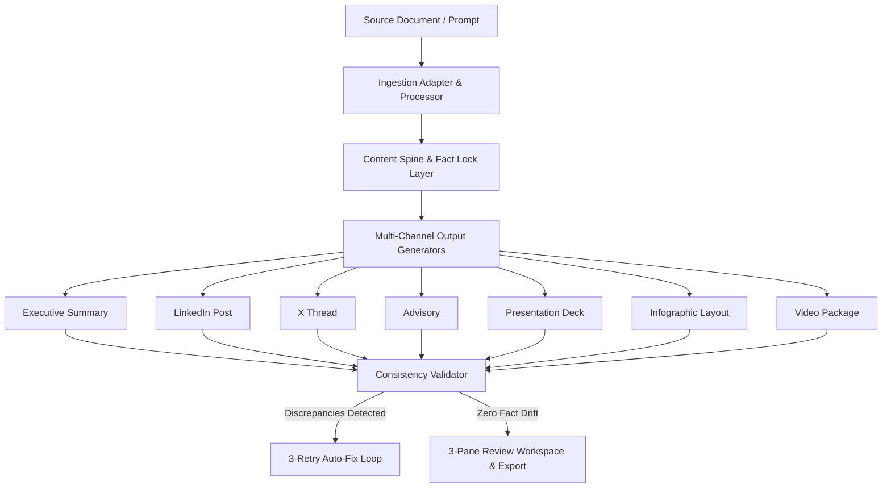

# 🚀 SIH 2026 — AI-Powered Content Transformation Engine

> **Single Source of Truth (Content Spine) & Fact-Locking Multi-Channel Content Generator**

---

## 📌 Problem & Solution

* **The Problem**: Corporate communications, technical documentation, public advisories, and social media releases derived from single source documents often introduce fact drift, inconsistent dates, altered statistics, and hallucinated claims.
* **The Solution**: An end-to-end AI platform that ingests raw source material (PDF, DOCX, TXT, Images, JSON), constructs an immutable **Content Spine** with a **Fact Lock Layer**, generates 7 distinct channel deliverables simultaneously, and runs an automated **Consistency Validator** loop.

---

## ⚡ Key Features

* **Multi-Format Source Ingestion**: Supports PDF, TXT, MD, JSON, Images, DOCX, and free-form prompts.
* **Content Spine Architecture**: Single source of truth containing entities, facts, events, risks, recommendations, and source references.
* **Fact Lock Layer**: Automatically classifies and locks critical facts to prevent LLM hallucinations.
* **Multi-Output Generation Engine**: Simultaneously generates 7 distinct communication formats:
  1. Executive Summary
  2. LinkedIn Post
  3. X (Twitter) Thread
  4. Official Advisory
  5. Presentation Deck (Slide Cards)
  6. Infographic Layout Spec
  7. Complete Video Production Package (Storyboard & Scripts)
* **Consistency Validator**: 8-category fact contradiction detector with proportional scoring (`0–100%`).
* **Auto-Fix Loop**: 3-retry automated correction engine that fixes fact drift and appends lock annotations.
* **4-Tier Source Traceability Inspector**:
  `Generated Statement` → `Content Spine Fact` → `Source Document` → `Raw Text Quote & Page Number`
* **Offline Demo Mode**: 100% functional deterministic demo mode requiring no external API keys.

---

## 🏗 System Architecture



---

## 🛠 Tech Stack

* **Frontend**: React 18, TypeScript, Vite, Lucide Icons, Glassmorphism CSS design system.
* **Backend**: Node.js, Express, TypeScript, Multer, Prisma ORM.
* **Database**: SQLite (default local) / PostgreSQL (production).
* **AI Abstraction**: Pluggable AI Provider (`MockProvider` for demo, `GeminiProvider`, `OpenAIProvider`).

---

## ⚡ Quick Start

### 1. Prerequisites
* Node.js v18+ and `npm`

### 2. Environment Setup
Create `server/.env`:
```env
PORT=5001
NODE_ENV=development
DATABASE_URL="file:./dev.db"
AI_PROVIDER=gemini
AI_API_KEY=your_gemini_api_key_here
AI_MODEL=gemini-3.1-flash-lite
DEMO_MODE=false
```

### 3. Install & Run
```bash
# Terminal 1 — Backend
cd server
npm install
npx prisma generate
npm run dev

# Terminal 2 — Frontend
cd client
npm install
npm run dev
```

Open [http://localhost:5173](http://localhost:5173) in your browser.

---

## 📄 Documentation Index

* [PRD.md](file:///Users/himanshusingh/Downloads/hackathon/SIH/PRD.md) — Product Requirements Document
* [ARCHITECTURE.md](file:///Users/himanshusingh/Downloads/hackathon/SIH/ARCHITECTURE.md) — Complete System & Data Architecture
* [API.md](file:///Users/himanshusingh/Downloads/hackathon/SIH/API.md) — REST API Endpoints Reference
* [FEATURES.md](file:///Users/himanshusingh/Downloads/hackathon/SIH/FEATURES.md) — Full Feature Matrix
* [DATABASE.md](file:///Users/himanshusingh/Downloads/hackathon/SIH/DATABASE.md) — Prisma Database Schema & Models
* [SECURITY.md](file:///Users/himanshusingh/Downloads/hackathon/SIH/SECURITY.md) — Security & Secret Exposure Audit
* [DEPLOYMENT.md](file:///Users/himanshusingh/Downloads/hackathon/SIH/DEPLOYMENT.md) — Production Deployment Guide
* [DEMO_SCRIPT.md](file:///Users/himanshusingh/Downloads/hackathon/SIH/DEMO_SCRIPT.md) — Step-by-Step SIH Demo Walkthrough

---

## 📜 License

[MIT License](file:///Users/himanshusingh/Downloads/hackathon/SIH/LICENSE.md) © 2026 SIH Development Team.
