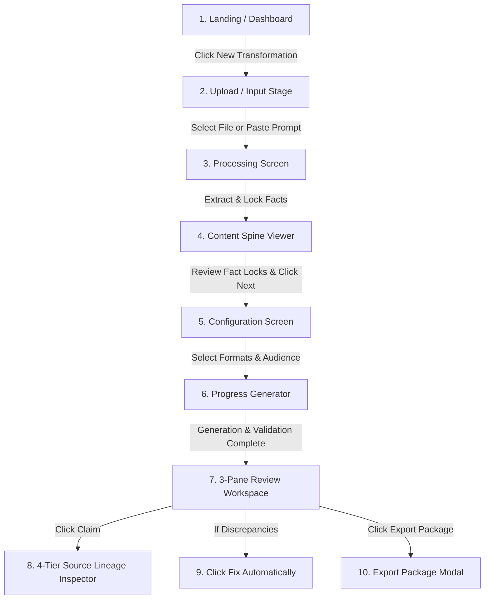

# End-to-End User Flow & Lifecycle — ContentSpine AI

---

## Screen-by-Screen User Journey

### Step 1: Dashboard (`route: 'dashboard'`)
* Displays overview stats: Active Projects, Average Consistency Score (`100%`), Total Facts Protected.
* Action: Click **"New Transformation"** CTA or load benchmark demo.

### Step 2: New Transformation (`route: 'new-transformation'`)
* Input options: Drag & Drop PDF/DOCX/Image, paste raw text, or select input category (Threat Intel, Policy Report, Research Paper).
* Action: Click **"Process Document"** or **"Load Demo Benchmark"**.

### Step 3: Processing (`route: 'processing'`)
* Animated step progress bar:
  `Uploading → Extracting → Understanding → Building Content Spine → Locking Facts → Ready`

### Step 4: Content Spine Viewer (`route: 'spine'`)
* Displays extracted Source Overview, Summary, Entities, Dates, Numbers, Risks, Recommendations, and Fact Lock Toggles.
* Action: Verify locked facts and click **"Proceed to Output Configuration"**.

### Step 5: Configuration Screen (`route: 'config'`)
* Select Target Audience Profile: `EXECUTIVE`, `TECHNICAL`, `GOVERNMENT`, `PUBLIC`.
* Checkbox selection for 7 deliverables.
* Action: Click **"Generate Deliverables"**.

### Step 6: Generation Progress (`route: 'generation'`)
* Animated progress bar showing real-time deliverable generation & consistency validation status.

### Step 7: Review Workspace (`route: 'workspace'`)
* 3-Pane Layout:
  * **Left Pane**: Format selector (Executive Summary, LinkedIn, X Thread, Advisory, Presentation, Infographic, Video Package).
  * **Center Pane**: Format preview container, `[Why was this generated?]`, `[Regenerate]`, `[Copy]`.
  * **Right Pane**: 4-Tier Source Lineage Inspector, Discrepancy Cards, and Fact Drift Test Harness.

### Step 8: Export Package (`route: 'export'`)
* Select export format: JSON Package, Plain Text (.txt), Markdown (.md), HTML Presentation Deck, Video Script Package, or Print View.
